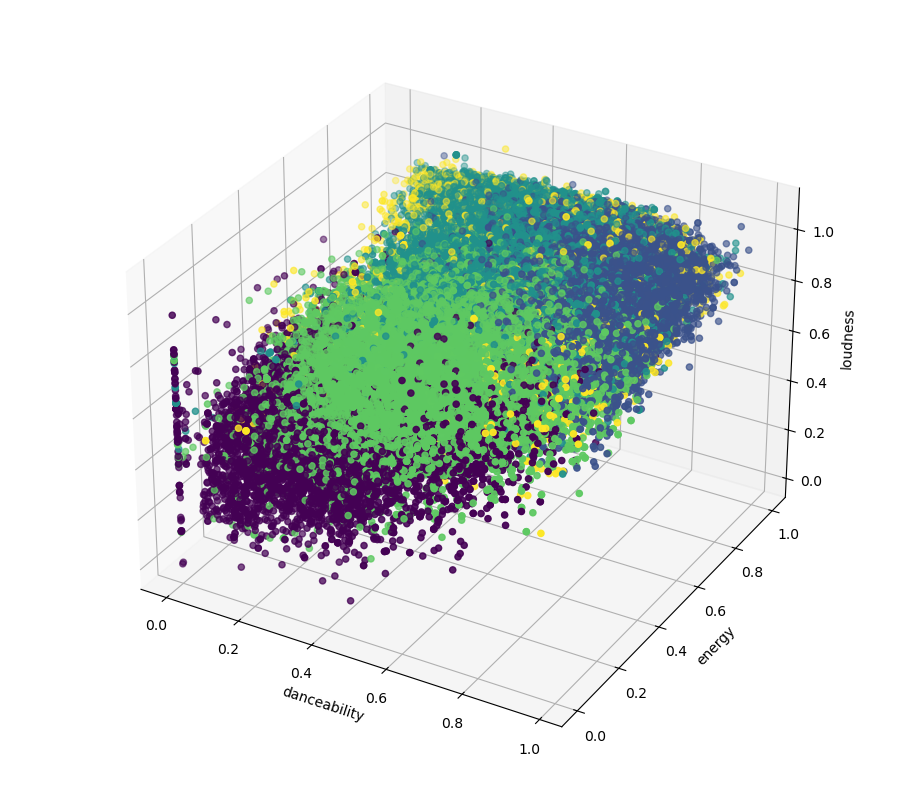

# Spotify Song Clustering Model

## Project Overview
This project implements clustering algorithms to categorize 114,000 Spotify songs based on their audio features. The goal is to identify patterns and groupings within the music dataset using unsupervised machine learning techniques. The clusters are expected to represent underlying emotional characteristics of the songs.

## Dataset
- Source: 🎹 Spotify Tracks Dataset @ Kaggle - https://www.kaggle.com/datasets/maharshipandya/-spotify-tracks-dataset
- Size: 114,000 songs
- Attributes: 9 audio features used for clustering

## Methodology
Two clustering algorithms were implemented using scikit-learn:
1. K-means
2. DBSCAN (Density-Based Spatial Clustering of Applications with Noise)

These algorithms were chosen to explore both centroid-based and density-based clustering approaches.

## Features
The following 9 audio features were used for clustering:
1. Danceability
2. Energy
3. Loudness
4. Speechiness
5. Acousticness
6. Instrumentalness
7. Liveness
8. Valence
9. Tempo

## Usage
To run the clustering model, use the following command:
```shell
python main.py [-t] [n] [algorithm] [feature1] [feature2] [feature3]
```
This command will run K-means with 5 clusters, show the training process, and display the clusters using valence, tempo, and energy features.

## Visualization
When run with default settings (e.g., `python main.py kmeans 5`), the plot will display:

- X-axis: Danceability
- Y-axis: Energy
- Z-axis: Loudness

Each point in the scatter plot represents a song, and the colors indicate different clusters. This visualization helps to understand how songs are grouped based on their audio features.



## Dependencies
- Python 3.x
- scikit-learn
- numpy
- pandas 
- matplotlib

## Installation
```shell
pip install scikit-learn numpy pandas matplotlib
```

## Future Work
- Analyze the emotional characteristics of each cluster
- Experiment with other clustering algorithms (e.g., Hierarchical Clustering, Gaussian Mixture Models)
- Incorporate additional features or metadata (e.g., genre, release year)
- Develop a recommendation system based on the clustering results

## Contact
Email: knguy@purdue.edu
